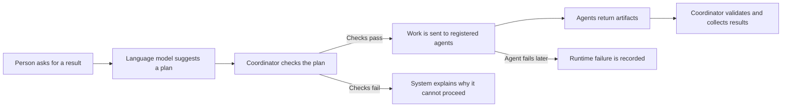
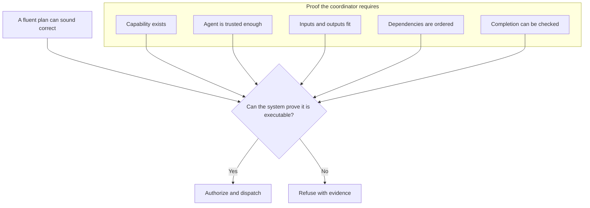
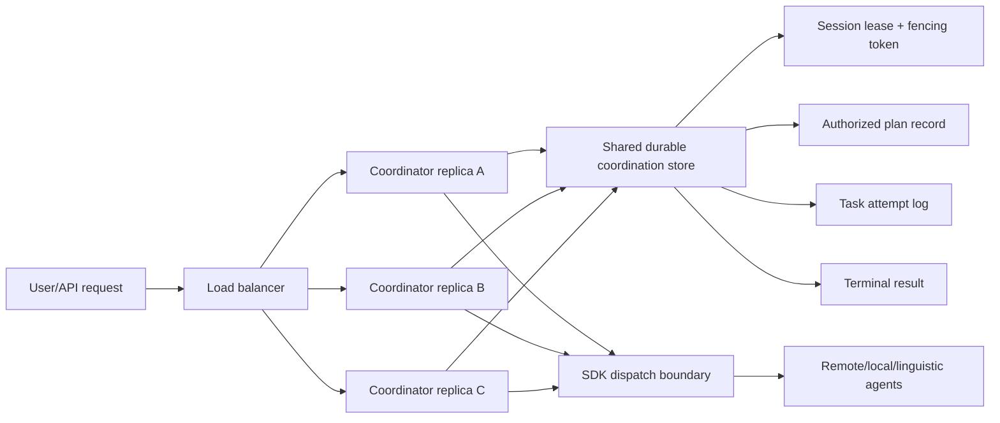
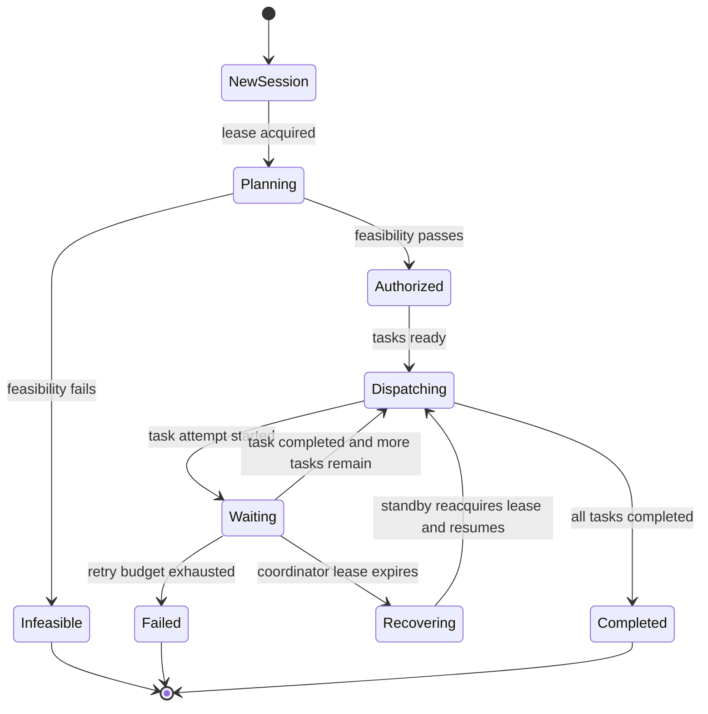

# Current Thesis Behavior, Formal Review, and Distributed-Coordinator Migration Plan

This note reviews the current thesis and implementation state after the latest
results update. It is written for three uses: explaining the system to a general
audience, receiving formal tutor/reviser feedback, and planning the migration
from one logical coordinator process to a distributed coordinator design.

Detailed operational checklists are split into companion plan files:

- `thesis_completion_fine_grained_plan.md` converts the thesis evidence and
  manuscript-completion protocol into executable steps.
- `distributed_coordinator_migration_fine_grained_plan.md` converts the
  distributed-coordinator migration into implementation and verification steps.

## 1. Simple Public Summary

### One-Sentence Explanation

The system lets an AI propose a plan, but it only lets the plan run after a
separate rule-based coordinator checks that the right agents, permissions,
inputs, outputs, and evidence are really available.

### Plain-Language Story

Imagine a city help desk. A citizen asks for something. A language model is like
the receptionist: it understands the request and suggests which departments
could help. The coordinator is like a permit officer: it checks whether those
departments actually exist, whether they are allowed to do the work, whether
their outputs fit together, and whether the final result can be inspected. Only
then does the system send work to the departments.

If the request cannot be supported, the coordinator refuses clearly instead of
pretending. If the request is supported but a worker fails later, the system
records that as a runtime failure rather than confusing it with a bad plan.

### Public Diagram: What Happens Today

### Public Diagram: Why The Coordinator Matters

### Simple Current Behavior

- The language layer proposes or interprets; it does not authorize execution.
- The symbolic feasibility layer authorizes, refuses, or records why a plan is
  not executable.
- The SDK is the only dispatch path for remote A2A agents, local Python agents,
  and linguistic agents.
- The ledger records sessions, authorization decisions, task attempts, task
  results, runtime failures, and terminal results.
- The current evidence shows seven deterministic scenarios matching their
  expected status, eleven Docker A2A checks passing, and two local LLM reference
  batches producing schema-valid but non-authoritative candidate outputs.

## 2. Formal Tutor/Reviser Critique

### Overall Assessment

The thesis has a coherent central contribution: it separates linguistic
proposal from symbolic authorization in heterogeneous multi-agent coordination.
The current manuscript is much stronger after adding real prototype evidence.
It now avoids the earlier risk of presenting an evaluation protocol as if it
were an empirical result. The strongest parts are the theoretical framework,
the implementation mapping, and the honest distinction between planning
feasibility and runtime success.

The main weakness is that the empirical evidence remains prototype-scale. The
results support the architectural boundary, but they do not yet establish broad
performance, robustness, or superiority over baselines. This is acceptable if
the thesis is framed as a design-science artifact with reproducible prototype
evidence, but it should not be framed as a full comparative benchmark study.

### Implementation Critique

| Severity | Issue | Why It Matters | Recommended Action |
|---|---|---|---|
| High | The coordinator is still a single logical authority with no lease, consensus, or replicated state machine. | The system can recover simple sessions from a ledger, but it is not highly available. A coordinator crash during dispatch can still create ambiguity around ownership and retries. | Implement session leases, fencing tokens, and a shared durable store before claiming distributed coordination. |
| High | The JSONL ledger is append-only and useful for tests, but not a production-grade distributed log. | It has process-local locking only, no cross-process transaction isolation, no compare-and-swap semantics, no compaction, and no durable lease ownership. | Replace or wrap it with PostgreSQL, SQLite WAL with strict locking for local experiments, Redis Streams, NATS JetStream, Kafka, or another store with atomic ownership operations. |
| High | Duplicate dispatch protection is incomplete. | The coordinator sends session, plan, task, and attempt metadata, but receiving agents are not required to enforce idempotency. A retry or failover could repeat unsafe work. | Define idempotency keys and require agents or the SDK adapter to return prior results for duplicate attempts. |
| Medium | Registry snapshots are recorded, but dynamic registry changes are not deeply evaluated. | A distributed coordinator must distinguish the registry used for authorization from later registry state. | Add tests for agent disappearance, replacement, and stale registry snapshots after authorization. |
| Medium | Local LLM reference checks are useful but measure exact-name matching harshly. | The negative result supports the thesis boundary, but the metric may understate semantic usefulness. | Add a second semantic-alignment metric distinct from exact symbolic contract matching. |
| Medium | Docker harness uses deterministic fixture agents. | Good for reproducibility, limited for external validity. | Add one third-party or independently implemented A2A agent when possible. |
| Medium | Recovery test demonstrates skip-completed behavior, not full failover. | It proves a narrow recovery property, not distributed resilience. | Add crash-injection tests at precise points: before authorization append, after authorization append, after dispatch start, after task completion before result append, and during aggregation. |
| Low | The SDK owns many responsibilities in one class. | It is manageable now, but distributed coordination will make adapter, registry, tracing, and idempotency responsibilities more complex. | Split interfaces around registry, dispatch, trace, artifact validation, and idempotency when migration begins. |

### Writing Critique

| Severity | Issue | Why It Matters | Recommended Action |
|---|---|---|---|
| High | The thesis must consistently signal that current evidence is prototype-scale. | A committee may challenge broad claims if the wording sounds like benchmark superiority. | Keep the current cautious framing in abstract, results, discussion, and conclusion. |
| High | The distributed-coordination future work needs sharper separation from current implementation. | The manuscript discusses hot standby and crash tolerance, but the implementation only proves session resume and retry behavior. | Add a compact table: "Implemented now" vs. "Required for distributed coordinator." |
| Medium | Results chapter reports counts but not enough methodological interpretation of each scenario class. | Readers need to see why each scenario matters to the research questions. | Add one short paragraph grouping scenarios by direct success, explicit refusal, runtime failure, and bounded auxiliary behavior. |
| Medium | Local LLM reference outcomes need more explanatory framing. | The 0/7 exact requirement-name result could look like failure unless explained. | State clearly that exact symbolic names are contracts, while LLMs are only semantic proposal sources. |
| Medium | Some tables are dense and may feel like engineering reports rather than thesis argument. | A thesis reader needs the result-to-claim relationship. | Add "What this proves" sentences after each table. |
| Low | The introduction could preview the actual evidence now that results exist. | It still reads slightly like a planned evaluation in places. | Add one sentence summarizing the three evidence layers. |
| Low | The conclusion is honest but could be more assertive about the achieved contribution. | It currently avoids overclaiming, which is good, but can still state the implemented boundary strongly. | Emphasize that the contribution is a reproducible pattern, not only a conceptual proposal. |

### Formal Reviser Verdict

The thesis is defensible as a design-science thesis with a working prototype and
reproducible evidence. It is not yet defensible as a broad empirical benchmark
or as a distributed-systems thesis. The writing should protect that boundary:
claim a precise coordination architecture, clear authorization semantics, and
prototype evidence; do not claim general superiority, production safety, or
distributed fault tolerance.

## 3. Must-Do Plan: From Single Coordinator To Distributed Coordinator

### Target Architecture

The migration goal is not to remove the logical authorization boundary. The
goal is to keep one authoritative decision per session while allowing multiple
coordinator processes to provide availability, recovery, and load sharing.

### Required State Model

### Phase 1: Make Current State Explicit

Must do:

1. Define a formal `SessionState` enum: `new`, `planning`, `authorized`,
   `dispatching`, `recovering`, `completed`, `failed`, `infeasible`.
2. Define a formal `TaskState` enum: `pending`, `leased`, `running`,
   `completed`, `failed`, `timeout`, `skipped`.
3. Add explicit `CommitmentState` records for each authorized task.
4. Persist the registry snapshot hash used for authorization.
5. Persist a monotonic event sequence number per session.
6. Add invariant checks: one terminal result per session, one authorized plan per
   plan generation, no dispatch before authorization, no task completion without
   an attempt record.

Acceptance evidence:

- Unit tests that fold event logs into deterministic session state.
- Property-style tests for invalid state transitions.
- Documentation table mapping thesis concepts to durable records.

### Phase 2: Replace JSONL With A Shared Durable Store

Must do:

1. Select a store with atomic conditional updates. Recommended first step:
   PostgreSQL, because it supports transactions, row locks, unique constraints,
   advisory locks, and durable audit tables.
2. Create tables for sessions, plans, registry snapshots, task commitments, task
   attempts, artifacts, leases, and events.
3. Enforce unique constraints:
   - one active lease per session
   - one terminal result per session
   - one task-attempt result per attempt ID
   - one authorized active plan per plan generation
4. Keep append-only events, but derive current state from transactional tables
   for fast recovery.
5. Preserve the JSONL ledger only as a local/testing backend.

Acceptance evidence:

- Migration scripts.
- Repository interface tests run against both JSONL and PostgreSQL backends.
- Crash/restart test proving state survives process death.

### Phase 3: Add Leases And Fencing Tokens

Must do:

1. Add `coordinator_id` for every coordinator process.
2. Add session lease records: `session_id`, `holder_id`, `fencing_token`,
   `expires_at`, `heartbeat_at`.
3. Require a valid lease before planning, dispatching, retrying, or completing a
   session.
4. Increment fencing token on every lease acquisition.
5. Include fencing token in every task dispatch metadata payload.
6. Reject writes from stale fencing tokens.

Acceptance evidence:

- Two coordinator processes competing for the same session cannot both dispatch.
- If the active coordinator stops heartbeating, a standby takes over only after
  lease expiry.
- Stale coordinator writes are rejected after takeover.

### Phase 4: Make Dispatch Idempotent

Must do:

1. Define idempotency key:
   `session_id + plan_id + task_id + attempt_id`.
2. Require SDK adapters to send the idempotency key to remote A2A agents where
   the protocol allows metadata.
3. For local and linguistic agents, add an SDK-side idempotency cache backed by
   the durable store.
4. Define agent behavior for duplicate attempts:
   - return prior completed result when safe
   - return duplicate-detected refusal when unsafe
   - never silently execute the same unsafe action twice
5. Add artifact provenance linking each artifact to exactly one attempt.

Acceptance evidence:

- Duplicate dispatch test for local agent.
- Duplicate dispatch test for remote fixture agent.
- Recovery test where a coordinator crashes after dispatch but before recording
  completion; standby must not blindly repeat unsafe work.

### Phase 5: Implement Recovery And Replanning Rules

Must do:

1. On takeover, reconstruct session state from durable store.
2. Skip completed tasks.
3. Resume pending tasks whose dependencies are satisfied.
4. Mark expired in-flight attempts as `unknown` or `timeout` according to policy.
5. Replan only when:
   - the original task has no terminal result,
   - the original executor is unavailable,
   - a compatible replacement exists in the authorized registry policy,
   - the new plan passes feasibility checks.
6. Record replanning as a new plan generation, not as an invisible mutation of
   the old plan.

Acceptance evidence:

- Crash before authorization: no dispatch after restart without authorization.
- Crash after authorization before dispatch: standby dispatches once.
- Crash after partial completion: standby skips completed work.
- Executor unavailable after authorization: standby either replans with evidence
  or fails explicitly.

### Phase 6: Add Distributed Test Harness

Must do:

1. Extend Docker compose to run three coordinator replicas.
2. Add a shared durable store container.
3. Add a test runner that can kill a coordinator at controlled points.
4. Add fault-injection hooks:
   - before plan authorization write
   - after plan authorization write
   - after task attempt start
   - after external dispatch
   - after task result received but before persistence
   - during aggregation
5. Measure duplicate dispatch count, recovery time, terminal correctness, and
   stale-write rejection.

Acceptance evidence:

- All single-coordinator Docker checks still pass.
- New failover matrix passes.
- Report includes recovery time, lease holder transitions, and duplicate
  dispatch observations.

### Phase 7: Update The Thesis

Must do:

1. Add a section distinguishing:
   - single logical coordinator,
   - replicated coordinator processes,
   - decentralized consensus among mutually suspicious coordinators.
2. Update implementation design with the durable store, leases, fencing tokens,
   idempotent dispatch, and failover flow.
3. Add a distributed-coordinator results table.
4. Update limitations: still crash-fault tolerant only unless Byzantine
   assumptions are explicitly addressed.
5. Add diagrams for the new distributed coordinator architecture and recovery
   state machine.

Acceptance evidence:

- The thesis no longer describes hot standby only as future work once it is
  implemented.
- Results include controlled crash/failover evidence.
- Discussion still avoids claiming Byzantine fault tolerance unless a consensus
  protocol and adversarial tests exist.

## 4. Minimum Next Sprint

If this migration is split into a first practical sprint, do only these:

1. Introduce explicit session/task state enums and invariant tests.
2. Define a `CoordinationStore` interface separate from `CoordinationLedger`.
3. Implement PostgreSQL-backed session/event storage.
4. Add session leases and fencing tokens.
5. Add a two-coordinator Docker test where one coordinator loses its lease and
   stale writes are rejected.

This sprint would not complete full distributed coordination, but it would cross
the most important conceptual boundary: from "a single process with a recovery
log" to "multiple coordinator processes governed by durable ownership state."
