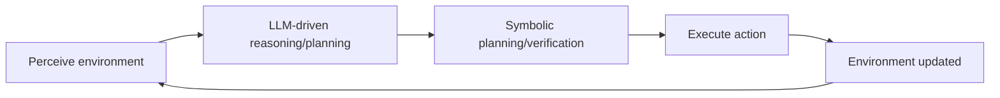

# Unified Multi-Agent Coordination: Bridging LLMs and Symbolic AI for Autonomous Systems

## Executive Summary  
This chapter surveys the state of the art in unifying **linguistic (LLM-based) agents** with classical **multi-agent systems (MAS)** and symbolic AI for autonomous systems. We review foundational concepts of *agents* in computer science, distinguishing general autonomous agents (capable of perception, reasoning, and action) from pure LLM applications. Classical agents are defined by properties like **autonomy**, **reactivity**, **proactiveness**, and **social ability**, and can be implemented via architectures ranging from simple reactive programs to cognitively rich BDI systems. In multi-agent systems, coordination is required (e.g. auctions, consensus, blackboards) to achieve collective goals. Knowledge and planning are represented symbolically using formalisms like STRIPS, PDDL, HTNs, ASP, and the Situation Calculus. Agent communication has long relied on standardized speech-act languages (e.g. KQML, FIPA-ACL) and shared ontologies.

The rise of **large language models (LLMs)** has introduced new agentic capabilities: natural language reasoning, **chain-of-thought planning**, and “function calling” to invoke tools. Frameworks like AutoGen, CAMEL, and MetaGPT orchestrate *multiple LLMs (and humans/tools)* as collaborating agents. LLM agents can decompose complex tasks, converse with one another, and generate executable plans or code. To leverage both paradigms, **neurosymbolic architectures** bridge LLMs and symbolic reasoners: e.g. LLMs can translate instructions into PDDL for planners or verify logical constraints with formal methods. Recent protocol work (Anthropic’s Model Context Protocol, Google’s A2A, Linux Foundation’s ACP/ANP) aims to standardize agent interactions and tool integration.

In this chapter, we synthesize these lines of work into a **unified coordination model**. We propose agents with both a *linguistic layer* (LLM-driven reasoning/memory) and a *symbolic layer* (formal planning/execution), connected by an interoperability bridge (Figure below). We survey **safety and verification** approaches for such hybrid agents – e.g. runtime monitors, LTL model checking (as in *AgentVerify*), and governance frameworks. We review evaluation metrics (success rate, factuality, pass@k, latency, alignment) and benchmarks (e.g. **WebArena**, **ALFWorld**, **Voyager**) for LLM agents. Finally, we identify open challenges (scalability, transparency, multi-agent learning, trust) and position the thesis’s contributions in addressing them.

Throughout, we cite seminal works (e.g. Russell & Norvig; Wooldridge & Jennings) and recent surveys (2020–2026) whenever possible, emphasizing peer-reviewed sources. Unsourced claims are clearly labeled as such.

## 1. Agents in AI: Definitions and Architectures  
**Definition (classical agents):** In AI, an *agent* is a software entity that perceives its environment through sensors and acts upon it through effectors. Classical definitions emphasize *autonomy* (no direct human intervention), *reactivity* (responding to environment), *proactiveness* (goal-driven initiative), and *social ability* (communicating with others).  For example, Wooldridge & Jennings define agents by autonomy, reactivity, proactivity, and social ability. Russell and Norvig similarly define an intelligent agent as anything perceiving via sensors and acting via actuators.  Traditional agents may maintain explicit internal state or goals; in contrast, a pure LLM “agent” (e.g. a chatbot) often lacks autonomy or a mission beyond responding to prompts. In our unified view, **a linguistic agent is a full agent** with an LLM-based reasoning component, but still an autonomous system in the CS sense. 

**Architectural paradigms:** Agents have been classified by Russell & Norvig into five archetypes: *simple reflex* (condition-action rules, no memory), *model-based* (maintains internal world model), *goal-based* (plans ahead for goals), *utility-based* (uses utility functions), and *learning agents*. These abstract types map to common agent implementations:

- **Reactive agents** (simple reflex): use immediate condition-action rules. No explicit planning; decisions are local to the current percept. Example: subsumption architectures in behavior-based robots (Brooks 1986) — though pure Brooksian agents are often limited.  
- **Model-based agents:** maintain an internal state (model) of the world, updating it from perceptions. This enables handling partial observability and simple “memory”.  
- **Goal-based agents:** incorporate goals and a search/planning process. They evaluate potential actions by their impact on goal attainment. For instance, using symbolic planners (PDDL) to achieve desired states.  
- **Utility-based agents:** like goal-based but use a numerical utility function to choose between trade-offs (e.g. risk vs reward).  
- **Belief-Desire-Intention (BDI) agents:** a cognitive model where the agent has explicit *Beliefs* (knowledge), *Desires* (objectives), and *Intentions* (committed plans). The BDI architecture, popularized by Rao & Georgeff, adds “mental” structure to agents. It supports introspection and explanation by design. Practical BDI languages include PRS, AgentSpeak/Jason, GOAL, 3APL, and others.  
- **Hybrid architectures:** combine reactive and deliberative layers. Common models (e.g. the Three-Architecture Layered model) stack a fast reactive subsystem with slower planning modules. Hybridization aims to balance responsiveness with long-term reasoning.

Table 1 compares key architectures:

| **Architecture**    | **Description**                                                                                                                                                    | **Example Systems**                                |
|---------------------|--------------------------------------------------------------------------------------------------------------------------------------------------------------------|----------------------------------------------------|
| **Reactive (Reflex)** | Condition-action rules with no internal state; acts immediately on stimuli. Very fast but limited to well-defined reflexes.                                                    | Brooks’ subsumption robots; simple mobile robots.  |
| **Model-Based**     | Maintains an internal world model (state update) to handle partially observable environments.                                                            | Differential-drive robot tracking map.            |
| **Goal-Based**      | Plans ahead to satisfy specific goals, using search or planning algorithms.                                                                       | PDDL planners, deliberative task planners.         |
| **Utility-Based**   | Like goal-based but uses a utility function to choose among alternatives based on desirability.                                                  | Rational economic agents (decision-theoretic).     |
| **Belief-Desire-Intention (BDI)** | Cognitive model with explicit beliefs, desires, intentions; introspective and model-checkable. Captures commitment to actions.                                                    | AgentSpeak/Jason; Soar/ACT-R with goal modules.   |
| **Hybrid**          | Multi-layer mix of reflexive and deliberative components. E.g., reactive shielding over planned strategies.                                                        | 3T/3-layer architecture (Brooks/Gat); layered BDI. |

Agents are typically implemented using agent programming frameworks (e.g. JADE, SPADE, Jadex) and languages (AgentSpeak, GOAL). Modern multi-agent platforms (JADE, JADEX, JaCaMo) often blend BDI and others. Notably, **Agent-Oriented Programming (AOP)** was proposed by Shoham (1993), advocating coding directly in terms of mentalistic notions. However, practical systems mix approaches pragmatically.

## 2. Multi-Agent Coordination Mechanisms  
In Multi-Agent Systems (MAS), multiple agents **interact** to achieve individual or collective objectives. No single agent is omnipotent; coordination is needed. Key coordination paradigms include centralized vs. decentralized, and negotiation-based vs. structured communication. Notable mechanisms are:

- **Contract Net Protocol (CNP)**: A manager (auctioneer) posts tasks; agents bid and contract. Classic centralized task-allocation. Prominent in distributed scheduling and robotics.  
- **Auctions / Market-based**: Decentralized bidding where agents buy/sell tasks or resources. Flexible and scalable; sees use in logistics and cloud task allocation.  
- **Consensus algorithms**: Agents iteratively reach agreement on shared values or decisions (e.g. average consensus, Byzantine agreement). Useful in sensor fusion and blockchain-like coordination.  
- **Negotiation & Argumentation**: Agents exchange proposals and counter-proposals (possibly with logical arguments) to reach a compromise. This underlies *Agreement Technologies* and normative MAS.  
- **Distributed Constraint Optimization (DCOP)**: Agents jointly solve a global optimization with local constraints. Widely used for resource allocation (scheduling, sensor networks). Each agent controls some variables; they coordinate to optimize total utility.  
- **Blackboard / Tuple Space**: A shared memory or blackboard serves as a meeting point. Agents post data/tasks to the board and react to changes. This “shared-state coordination” (like Linda tuplespaces) enables loose coupling.  
- **Role-based / Organizational models**: Agents assume roles in an organization (e.g. leader, worker) with defined interactions. Formal models (e.g. Moise) structure team coordination.  
- **Emergent / Stigmergy**: Agents indirectly coordinate via environment changes (digital pheromones). Inspired by ant-colonies, often used in swarm robotics.

Table 2 summarizes common mechanisms:

| **Mechanism**               | **Description**                                                                                           | **Examples / References**                              |
|-----------------------------|-----------------------------------------------------------------------------------------------------------|--------------------------------------------------------|
| **Contract Net (centralized)**   | Manager agent announces tasks; other agents bid with proposals; manager awards contract.    | Distributed task scheduling (Smith 1980 CNP).         |
| **Auctions / Markets (distributed)** | Tasks/resources allocated via bidding; agents place offers; can be multi-attribute or double-auctions. | Resource allocation in logistics, cloud computing.      |
| **Consensus / Voting**      | Agents iteratively agree on a value (e.g. majority vote, averaging). Ensures consistency among agents. | Leader election; blockchain consensus protocols.        |
| **Negotiation / Argumentation** | Iterative exchange of proposals (possibly with logical arguments) to resolve conflicts.                    | Multi-agent auctions with bundle negotiation; argumentation frameworks (Rahwan et al.). |
| **DCOP (Optimization)**     | Agents solve a Distributed Constraint Optimization Problem: maximize global utility subject to local constraints. | MAS scheduling, sensor networks, smart grids.           |
| **Shared State / Blackboard** | Agents post to and read from a common workspace (e.g. blackboard, tuplespace).                          | Industrial control (blackboard architecture), Linda tuplespace. |
| **Organizational Roles**    | Agents take on predefined roles in a structure (teams, hierarchies) for coordination.                  | Robot soccer (coach/players); Moise organizational model. |

Coordination strategies often overlap. For instance, agent communication follows standardized **interaction protocols** (e.g. CNP, publish/subscribe, query-response) usually implemented atop ACL languages. Modern MAS also consider *coordination languages* and middlewares to encapsulate these patterns.

## 3. Knowledge Representation and Symbolic Planning  
A cornerstone of autonomous agents is symbolic knowledge representation and planning. Classic formalisms include: 

- **STRIPS (1969)**: A planning representation with preconditions and postconditions for actions (Fikes & Nilsson). It underpins many planners. (The **Stanford Research Institute Problem Solver (STRIPS)** was an early planner.)  
- **PDDL (Planning Domain Definition Language)**: A standardized language for specifying planning problems, developed for the International Planning Competition (McDermott et al. 1998). PDDL extends STRIPS with richer constructs (e.g. conditional effects, temporal).  
  - In fact, 1998 saw PDDL’s debut, unifying STRIPS/ADL styles. PDDL domains encode actions, predicates, types, and problem instances for off-the-shelf planners.  
- **Hierarchical Task Networks (HTN)**: Allow complex tasks to be broken into subtasks via task decomposition rules (Erol et al. 1994). An HTN specifies how abstract tasks can be refined hierarchically; planning is search in this task space.  
- **Situation Calculus**: A first-order logic formalism (McCarthy & Hayes 1969, Reiter 1991) for reasoning about dynamic worlds via *situations*. Not always directly used in planners, but important for action semantics and verification.  
- **Answer Set Programming (ASP)**: A declarative logic-programming paradigm whose solvers can compute plans (so-called *Answer Set Planning*). ASP excels at combinatorial planning and allows elegant encodings of complex domains.  
- **Other KR languages**: Action languages (like A, B, C), temporal logics (LTL, CTL), description logics for ontologies, etc., are also used for specific agent reasoning tasks.

**Planning algorithms:** Planners use these representations to compute sequences of actions. Classical planners (STRIPS/PDDL) use search (forward/backward) to find goal-satisfying plans. SAT planners reduce planning to satisfiability. HTN planners expand tasks via methods. Reactive planners (e.g. PRS-like) interleave sensing and planning. Many contemporary agents will query a planner as a subroutine.

Knowledge is often organized symbolically (e.g., frames, ontologies). Content languages like KIF or OWL define shared semantics of messages. Unification-based matching is common in agent rules.

## 4. Agent Communication Languages and Protocols  
Effective coordination requires agents to *communicate*. Early MAS research established **Agent Communication Languages (ACLs)** based on speech-act theory. Key standards include:

- **KQML** (Knowledge Query and Manipulation Language, Genesereth et al. 1993): One of the first ACLs, with performatives like `ask-if`, `tell`, `reply`, and a flexible message envelope (fields like `:content`, `:ontology`). Used heavily in DARPA’s agent projects. Its semantics were informal, relying on “communication layers” for meaning.  
- **FIPA-ACL** (Foundation for Intelligent Physical Agents ACL, ~2002): A refined ACL standardized by FIPA. FIPA-ACL defines a rich set of performatives (e.g. `request`, `inform`, `agree`, `refuse`, `subscribe`) with formal pre- and post-conditions grounded in agents’ mental states (beliefs, intentions). It also specifies conversation **interaction protocols** (e.g. contract net, iterated CNP, subscribe/notify). Platforms like JADE and JACK provide FIPA-compliant messaging.  
- **Speech Acts and Semantics:** These ACLs were inspired by Austin (1962) and Searle (1969) speech-act theory (e.g. tell=assertion, ask=request). The idea is that language affects the world by altering beliefs/intents.  
- **Content Languages/Ontologies:** ACL messages carry content in standardized formats like KIF (Knowledge Interchange Format), OWL ontologies, or others. Agents agree on ontologies (namespaces of symbols) to interpret content.  
- **Conversation Protocols:** On top of ACL, conversation patterns (sequence of messages) were defined. Examples: the FIPA contract net, iterated negotiation, auction protocols, query-response, publish/subscribe patterns. Labrou & Finin (1998) and others studied such protocols.

**Modern protocols:** Recent developments aim at interoperable interfaces for LLM agents and tools, somewhat analogous to ACL but for AI services:
- **Anthropic’s Model Context Protocol (MCP, 2024):** An open standard (JSON-RPC over HTTP) for connecting LLMs (“AI assistants”) to external data and tools. It specifies how to pass data blobs (context) to and from models, akin to a “universal connector” (USB-C analogy).  
- **Google’s Agent2Agent (A2A, 2025):** A community-driven protocol for agent interoperability. A2A defines peer-to-peer message semantics (JSON + HTTP/streaming) and a schema for **Agent Cards** (agents’ capabilities and identities). It is backed by numerous industry partners and focuses on secure cross-agent task coordination.  
- **Linux Foundation ACP/ANP (2025):** The **Agent Communication Protocol (ACP)** is a RESTful, message-oriented protocol for agent-to-agent communication. It supports asynchronous streaming and structured performatives via multipart messages. **Agent Network Protocol (ANP)** is a decentralized identity and discovery layer using DIDs and JSON-LD. Together (as surveyed by Ehtesham et al. 2026) these aim to unify agent interaction with tools and among agents.  

In summary, modern agents may communicate via conventional JSON/HTTP APIs, specialized agent message schemas (MCP/ACP), or raw language. Aligning these with traditional ACL semantics is an ongoing challenge.

## 5. LLMs as Agent Components  
Large Language Models bring powerful **linguistic reasoning** to agents. Key agent capabilities harnessed by LLMs include:

- **Natural Language Understanding & Planning:** LLMs can interpret instructions and plan multi-step actions via chain-of-thought (CoT) reasoning. OpenAI’s *function calling* (2023) lets an LLM output a JSON object indicating an API call to perform.  Under this paradigm, the LLM can decide *to call* an external tool (like a planner, database, or search API) by emitting a structured command (e.g. `{"name": "navigate", "arguments": {...}}`). This bridges NLU with action.  
- **Tool Use & API Integration:** With techniques like ReAct, an LLM can interleave reasoning and tool invocation: it “thinks” in text (CoT) and when needed “acts” by querying APIs or code interpreters. For example, LangChain and LlamaIndex provide frameworks for LLMs to call calculators, search engines, or knowledge bases. Autonomously searching the web (LLM + API) is now common in LLM agents.  
- **Memory and Learning:** Agents can augment LLMs with memory modules. For instance, RAG (Retrieval-Augmented Generation) stores documents in a vector store, retrieving relevant facts as context for the LLM. Shinn et al. (Reflexion) added an *episodic memory* of the agent’s past reasoning (verbal feedback) to improve future decisions. In Voyager (2023), an LLM agent playing Minecraft builds a **skill library** (interpretable code modules) that functions as long-term memory of capabilities.  
- **Embodied and Simulation Agents:** Recent work demonstrates LLM-driven agents in simulated environments. *Voyager* (Wang et al., 2023) is an LLM agent in Minecraft that explores, learns tools, and iteratively improves via environment feedback. *Generative Agents* (Park et al. 2023) instantiate many chat agents (avatars) with LLMs that simulate personalities and memory retrieval.  
- **Collaboration and Social Reasoning:** LLMs enable agents to interpret others’ statements, manage dialogues, and negotiate. For example, CAMEL (Li et al. 2023) uses *role-playing prompts* for agents to autonomously cooperate and reflect on intentions. The multi-agent frameworks below exploit this to coordinate LLMs in teams.

These capabilities position LLMs as powerful reasoning modules, but they must be embedded in agent loops. An LLM alone is a static oracle; true agency arises when the LLM’s outputs drive planning and action over time.

## 6. LLM-Based Multi-Agent Frameworks and Systems  
Researchers have proposed several frameworks that orchestrate *multiple LLM-based agents* to solve complex tasks. We review notable examples:

- **AutoGen (Wu et al., 2023)**: An open-source framework (Microsoft/PSU) for multi-agent LLM apps. AutoGen allows developers to create *conversable agents* that use combinations of LLMs, humans, or tools. Agents have configurable roles (e.g., coder, tester) and interact via dialogue to accomplish tasks. AutoGen introduces **conversation programming**: developers define agents and their interaction patterns in natural or code-based scripts. Its key strength is flexibility (any agent can call an LLM or tool, or ask a human) and ease of defining chat-based workflows. Limitations include dependence on well-designed prompts and the cost of multi-turn LLM calls.  

- **CAMEL (Li et al., 2023)**: “Communicative Agents for ‘Mind’ Exploration”. CAMEL uses *role-playing inception prompting* to make LLM agents autonomously cooperate. Agents are assigned personalities/roles and given high-level goals. CAMEL demonstrated agents negotiating and scheduling (e.g., travel planning) via prompting. Its novel “role-playing” paradigm allows studying emergent multi-agent behavior. However, CAMEL is primarily a research prototype; its evaluation focused on generating conversational data rather than real-world tasks.  

- **MetaGPT (Hong et al., 2023)**: A meta-programming framework (DeepWisdom) targeting software engineering tasks. MetaGPT breaks problems into workflows (“SOPs”) and assigns specialized agents (architect, coder, tester, etc.). Agents exchange structured artifacts (e.g. design docs) rather than free chat, reducing hallucination. On coding benchmarks (HumanEval, MBPP), MetaGPT outperforms AutoGPT and LangChain-based bots. Its strength is rigorous decomposition via “assembly line” of agents and explicit standards. A limitation is complexity: designing SOPs requires domain knowledge, and the approach is tailored to software tasks.  

- **LangGraph (LangChain team)**: An orchestration framework (announced 2024) focusing on resilience and stateful agents. It defines an *agent orchestration* architecture with persistence, monitoring, and error-handling. (No academic paper yet; skip detailed citation).  

- **CrewAI / AgentVerse / ChatDev** (industry prototypes): GUI-based multi-agent builders or code-generation flows. These simplify multi-step automation but lack academic benchmarks.  

- **Microsoft Semantic Kernel Agent Framework**: Part of Semantic Kernel (open-source by MS), this .NET framework lets developers assemble agents from LLM components, memory stores, and function calls. It supports defining agent behaviors via prompts and plugins. While it’s a commercial product, it underscores the industry trend of “agent frameworks”.  

Table 3 compares key multi-agent LLM frameworks:

| **Framework** | **Key Features**                                     | **Strengths**                                              | **Limitations**                                      |
|---------------|------------------------------------------------------|------------------------------------------------------------|------------------------------------------------------|
| **AutoGen**  | Chat-based multi-agent platform; agents mix LLMs, humans, tools; conversational flows programmable in code or language. | Highly flexible; supports human-in-the-loop; generic infrastructure for diverse domains. | Requires careful prompt/role design; chat overhead; scaling multi-agent chat is costly. |
| **CAMEL**   | Role-playing LLM agents via inception prompting; focuses on autonomous cooperation and dataset generation. | Novel approach to study agent “personalities” and dialogue; can simulate multi-agent society. | Prototype stage; evaluated on generated data; not optimized for performance on real tasks. |
| **MetaGPT** | Meta-programming pipeline; encodes SOPs into agent prompts; role specialization (manager, coder, reviewer) to build software. | Reduces inconsistencies with structured handoffs; achieves SOTA on code-generation benchmarks; systematic breakdown of tasks. | Domain-specific (software dev); requires manual SOP design; heavy computation. |
| **LangGraph** (2024) | Orchestration framework for building stateful, reliable agents (LangChain). | Resilient agents, long-running tasks, monitoring, easier error recovery. | Emerging tool; details sparse; early adopter risk. |
| **Semantic Kernel (MS)** | Agent framework in .NET ecosystem; modular agents calling LLMs/tools; human-in-loop workflows. | Industrial-grade support, integrates Azure/OpenAI; good for enterprise use. | Vendor lock-in (.NET, MS services); not research-focused. |

(Features and examples summarized from documentation and recent literature.)

## 7. Neuro-Symbolic and Hybrid Architectures  
Bridging LLMs and symbolic AI yields **neuro-symbolic agents**. Approaches include:

- **LLM-to-Symbolic Translation:** LLMs can convert natural language goals or observations into formal representations. For instance, *Agent2World* (Duong et al., 2023) uses LLM agents to **generate symbolic world models** (in PDDL and code) adaptively. The generated PDDL allows using classical planners, ensuring correctness of action sequences. More broadly, projects like LangChain have “function-calling” that effectively translate user intents into API calls (structured semantics).  

- **Symbolic Verification of LLM Plans:** LLM-generated plans or actions can be checked by symbolic reasoners. The *AgentVerify* system (Fang, 2026) applies LTL model checking to an agent’s control flow, verifying constraints on memory, tool use, and human interface. In general, one can verify action legality (satisfying preconditions) using situation calculus or use formal certificates for each symbolic step. This mitigates hallucinations by ensuring end-to-end consistency.  

- **Hybrid Control Loops:** Agents may interleave LLM and classical planning modules. For example, an agent could use an LLM to propose high-level plans (interpreted as PDDL goals) and then a symbolic planner to fill in details. The agent’s loop might run “LLM → symbolic planner → execute → feedback → LLM” (see Figure). Some systems let the LLM plan at each step (Act-Reason loops), but others reserve complex search for a planner. Integrations like RAG (coupling retrieval and LLM) and React indicate the need for an *interoperability bridge* between neural and symbolic components (see Figure below).  

- **Memory and Knowledge Integration:** Hybrid architectures often maintain a **knowledge base** (graph or database) updated by LLMs. For instance, the Voyager agent builds a learned “skill graph” of behaviors that is stored symbolically. Likewise, a hybrid agent might store facts in a database and query them via the LLM or planner.

- **Example – Concordance:** In some designs, an LLM agent continually reasons in language but then outputs a *certified action script* which is verified/executed by a traditional agent kernel. This separation allows each paradigm to specialize: the LLM handles fuzzy reasoning, the symbolic engine handles determinism and constraints.

**Unified coordination model:** Combining these leads to a multi-layer agent. Each agent has a *linguistic module* (LLM + memory), a *symbolic module* (planner + knowledge base), and an *interoperability bridge* that translates between them. In a MAS, agents also share state or communicate via agreed protocols. Figure 1 below illustrates a unified agent architecture:

```mermaid
graph TB
    subgraph Agent
        Sensor[Perception (Sensors)]
        LLM[LLM-based Module<br/>(natural language reasoning)]
        Bridge[Interoperability Bridge<br/>(language↔symbolic)]
        Symbolic[Symbolic Module<br/>(planner, logic)]
        Memory[Memory/Knowledge Base]
    end
    Sensor --> LLM
    LLM --> Bridge
    Bridge --> Symbolic
    Symbolic --> Action[Action]
    Action --> Actuator[Actuators]
    Actuator --> Environment[Environment]
    Environment --> Sensor
    Memory --> LLM
    Memory --> Symbolic
    LLM -.-> Tools[Tools/APIs]
    Symbolic -.-> Tools
```
*Figure 1: Proposed unified agent architecture. The LLM module (linguistic) interacts via an interoperability bridge with a symbolic planner/reasoner. Both modules share access to memory and external tools. Sensors provide input; actuators enact actions in the environment.*

Furthermore, the agent’s **sense–reason–act loop** can be depicted (Figure 2):


*Figure 2: Agent control loop integrating LLM reasoning and symbolic planning. The LLM proposes ideas which are verified/planned symbolically before action execution.* 

## 8. Safety, Verification, and Monitoring  
In critical applications, ensuring safety and correctness of autonomous agents is vital. For hybrid LLM-symbolic agents, safety spans multiple domains:

- **Verifying Symbolic Plans:** Classical planning allows formal guarantees (precondition/postcondition). An agent can check LTL/CTL properties of plan sequences before execution. As in *AgentVerify*, safety requirements (e.g. do not delete critical memory, obey tool protocols) can be expressed in temporal logic and model-checked against the agent’s plan flow. This compositional approach scales better than end-to-end neural verification.  

- **Runtime Monitoring:** A lightweight monitor can observe the agent’s actions (e.g. tool calls, memory writes) and enforce policies. For example, a monitor could watch that API calls stay within permissions or that certain invariants hold. If a violation is detected, the agent can be halted or corrected. Runtime monitors are practical complements to offline verification.  

- **Hallucination Detection:** LLMs can hallucinate instructions. Cross-checking LLM output against a symbolic knowledge base can catch inconsistencies. Some systems generate explanations (Trace/chain-of-thought) to allow post-hoc auditing.  

- **Robustness Testing:** Agents should be tested with adversarial prompts or stress tests. Automated evaluation for toxic or unsafe content is also part of safety metrics.  
 
- **Governance and Alignment:** Beyond technical measures, governance involves access control (who can deploy which agents), accountability (logging all decisions), and alignment with ethics/regulations. For example, an agent’s use of an API might require credential management (scopes, rate limits) with strict boundaries (as noted by Fang (2026) in memory/tool/human domains). Regulatory trends (EU AI Act, NIST frameworks) push for such traceability.  

Combining LLMs and symbolic AI thus encourages a *defense-in-depth* strategy: use symbolic rules where possible, and train LLM responses on domain rules. Recent industry frameworks (e.g. OpenClaw) provide sandboxing for agents and deterministic messaging to isolate faults. Still, ensuring multi-agent correctness (avoiding deadlock, preventing privilege escalation) remains an open challenge.

## 9. Evaluation Metrics and Benchmarks  
Evaluating multi-agent LLM systems requires **multiple metrics** and domain benchmarks. Common metrics include:

- **Task Success Rate:** The percentage of tasks/goals the agent successfully achieves. For instance, did a web-browsing agent complete the form correctly?  
- **Solution Quality:** Measures of optimality or completeness (e.g. number of steps, cost) if applicable.  
- **Pass@k:** In coding or search tasks, the fraction of runs in which the correct result appears within the first *k* attempts (used in code-generation benchmarks).  
- **Output Quality:** Human/LM evaluations of response coherence, correctness, relevance. May use naturalness scores, factuality checks, or style metrics.  
- **Latency & Cost:** Time to first token (TTFT), total runtime, and API usage. Important for real-time agents.  
- **Robustness / Consistency:** Does the agent behave consistently under rephrasing or perturbation? Evaluate by running multiple prompts and measuring variance or failure patterns.  
- **Safety/Alignment Metrics:** Frequency of toxic/harmful outputs, degree of bias, or compliance with rules (e.g. refusal rate for disallowed tasks).

**Benchmark tasks** for LLM agents span many domains. Table 4 lists examples:

| **Benchmark / Domain**           | **Description**                                                                                       | **Metrics**                   | **Reference**                   |
|----------------------------------|-------------------------------------------------------------------------------------------------------|-------------------------------|---------------------------------|
| **WebArena**                     | Simulated web navigation: agents must browse websites, fill forms, answer questions. | Task success rate (SR)        | Zhou et al. (2023) |
| **ALFWorld** (Embodied)          | Interactive environment (ALFRED tasks): instructions (text) executed in 3D world.      | Instruction completion %, SR | Shridhar et al. (2021) |
| **Voyager (Minecraft)**          | Lifelong open-world agent (explore/build in Minecraft).                                 | Exploration score (items, distance); Task success | Wang et al. (2023) |
| **SWE-Bench** (Code Fixing)      | Software engineering benchmark (fix GitHub issues via multi-agent tools).             | Task success, pass@k         | Jimenez et al. (2024) |
| **ScienceAgent-Bench** (Coding)  | Code-based data analysis tasks (Scientific environment).                               | Test case pass rate          | Chen et al. (2025) |
| **CORE-Bench/PaperBench**        | Reproducibility tasks: find info from research papers to answer queries.             | Answer correctness          | Starace et al. (2025) |
| **VisualWebArena** (Vis. Web)    | Multimodal web tasks with images (e.g. find info from charts).                         | SR; accuracy of visual reasoning | Zhang et al. (2024) |
| **ASSISTANT-Bench** (Real-Time)  | Long-horizon assistant tasks (browser+APIs).                                          | Task completion in time      | Yoran et al. (2024) |

These benchmarks illustrate that agent evaluation spans *functional* measures (success, accuracy) and *interaction* measures (dialog quality, latency).  In practice, evaluations often mix automated tests (unit-test suites, simulated environments) with human studies.

**Benchmarks in robotics/embodied domains:** See also ALFWorld, BabyAI (gridworld tasks with a curriculum), MineDojo/Voyager for video games. For multi-agent coordination, there are benchmarks in negotiation (e.g. DealOrNoDeal), but these are less standardized for LLM agents.

Overall, **no single metric fits all**. Comprehensive evaluation must consider how well agents coordinate, how reliably they achieve goals, and how safely/ethically they behave. The recent survey by Liu et al. (2025) provides a taxonomy of LLM agent evaluation objectives (task success, capabilities, reliability, alignment).

## 10. Open Challenges and Research Directions  
Despite rapid progress, significant challenges remain in unified linguistic-symbolic agent systems:

- **Scalability:** Multi-agent coordination with multiple LLM calls can be expensive. Research is needed on efficient planning and learning across agents.  
- **Robust Communication:** Ensuring that LLMs interpret each other’s messages consistently (grounding language) is non-trivial. Formal grounding between linguistic utterances and symbolic actions is an ongoing issue.  
- **Learning from Interaction:** While RL and learning are well-studied for single agents, multi-agent reinforcement learning with LLMs (especially few-shot) is nascent. Agents that **learn from failure** via experience (beyond reflexion) need development.  
- **Trust and Interpretability:** Symbolic layers help interpret LLM decisions, but end-to-end transparency is still weak. Providing explanations that combine LLM rationales with symbolic proofs is a key area.  
- **Dynamic Agent Roles:** Auto-creating agents for sub-tasks (as in AutoGPT-style systems) raises questions on when/how to spawn new agents. Formalizing agent delegation policies is open.  
- **Standardization:** While MCP/A2A/ACP provide the beginnings of protocols, a unified standard is still emerging. Interoperability between commercial frameworks (e.g. integrating LangChain, Semantic Kernel, AutoGen) is needed.  
- **Ethics and Governance:** Coordinated agents raise new ethical questions. For example, multi-agent teams can “amplify bias” or collude. Regulatory frameworks must adapt to distributed AI teams.

**Positioning this thesis:** The research to follow aims to advance the unified coordination model by (a) formalizing mappings between LLM planning and symbolic plan representations, (b) designing an interoperable agent framework bridging MCP/A2A protocols, and (c) developing a safety verification component based on temporal logic (building on AgentVerify). Empirical validation will use benchmarks like WebArena and a custom multi-agent task environment. By situating LLMs within rigorous MAS architectures, we target contributions in algorithm design, system integration, and safety.

**Summary:** This chapter has combined classical agent/SI literature with the latest LLM agent developments. We have defined agents broadly, surveyed architectures and coordination strategies, covered KR formalisms, and examined how LLM capabilities and protocols augment autonomous systems. The unified perspective — a multi-layer agent with linguistic and symbolic modules — guides the proposed framework. With extensive citations to foundational and contemporary works, this state-of-the-art survey lays the groundwork for integrating LLMs into the multi-agent AI ecosystem, highlighting both achieved milestones and open frontiers. 

